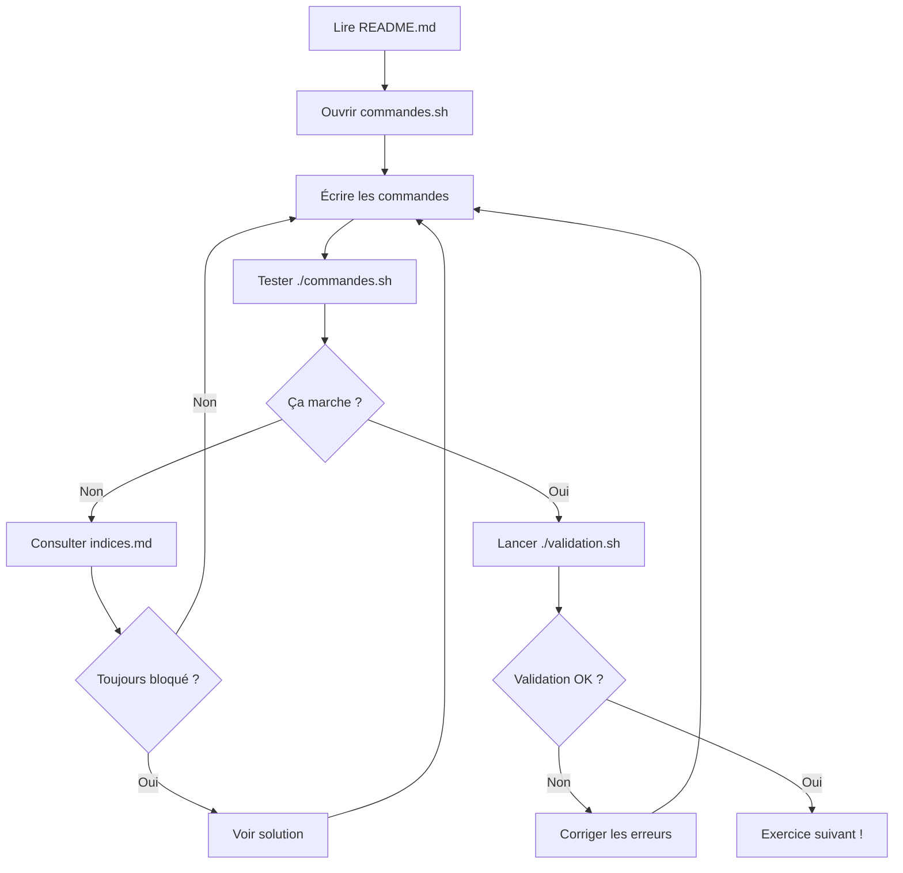

# 📚 Guide d'Apprentissage Progressif - Podman Workshop

## 🎯 Philosophie d'apprentissage

Ce workshop adopte une approche **"learning by doing"** où vous écrivez vos propres commandes au lieu de copier-coller des solutions toutes faites.

## 🏗️ Structure des exercices

Chaque TP contient des exercices structurés comme suit :

```
TPX-nom-du-tp/
├── exercices/
│   ├── exercice-01/
│   │   ├── README.md              # 📋 Énoncé et objectifs
│   │   ├── commandes.sh           # ✏️  Fichier à compléter
│   │   ├── validation.sh          # ✅ Script de validation
│   │   └── indices.md             # 💡 Indices progressifs
│   ├── exercice-02/
│   │   └── ...
├── solutions/
│   └── exercice-XX-solution.sh    # 🔐 Solutions complètes
```

## 📝 Comment travailler sur un exercice

### Étape 1 : Lire l'énoncé
```bash
cd TP1-conteneurs-simples/exercices/exercice-01
cat README.md
```

### Étape 2 : Compléter le fichier commandes.sh
```bash
nano commandes.sh
# ou
vim commandes.sh
# ou votre éditeur préféré
```

Le fichier contient des **placeholders** à remplacer :
```bash
# TODO: Lancez un conteneur nginx en mode détaché
podman run ___COMPLETER_ICI___

# TODO: Listez les conteneurs en cours d'exécution
podman ___COMPLETER_ICI___
```

### Étape 3 : Tester vos commandes
```bash
# Exécutez vos commandes
./commandes.sh

# Validez votre travail
./validation.sh
```

### Étape 4 : Utiliser les indices si besoin

Si vous êtes bloqué, consultez les indices progressifs :

```bash
cat indices.md
```

Les indices sont organisés par niveau :
- **Niveau 1** : Orientation générale
- **Niveau 2** : Structure de la commande
- **Niveau 3** : Commande presque complète

### Étape 5 : Consulter la solution (dernier recours)

```bash
cat ../../solutions/exercice-01-solution.sh
```

⚠️ **Essayez d'abord par vous-même !** La solution ne devrait être consultée qu'après avoir vraiment essayé.

## ✅ Système de validation

Chaque exercice a un script `validation.sh` qui vérifie :

- ✓ Les conteneurs sont créés avec les bons noms
- ✓ Les ports sont correctement mappés
- ✓ Les services répondent comme attendu
- ✓ Les configurations sont correctes

### Exemple de sortie de validation :

```
═══════════════════════════════════════════════════════
  Validation Exercice 1: Lancer un conteneur
═══════════════════════════════════════════════════════

✓ Le conteneur 'mon-nginx' existe
✓ Le conteneur 'mon-nginx' est en cours d'exécution
✓ Le port 8080 est correctement mappé
✓ Le service HTTP répond sur http://localhost:8080

Progression: [████████████████████] 100% (4/4)

═══════════════════════════════════════════════════════
  Résultat: Exercice 1
═══════════════════════════════════════════════════════

✓ Exercice réussi ! Tous les tests sont passés (4/4)

ℹ Vous pouvez passer à l'exercice suivant !
```

## 🎓 Conseils pour apprendre efficacement

### 1. Ne copiez pas les solutions
L'objectif est de **comprendre** les commandes, pas de les copier. Prenez le temps de :
- Lire la documentation Podman si besoin
- Expérimenter avec les options
- Comprendre chaque flag

### 2. Consultez l'aide intégrée
```bash
podman --help
podman run --help
man podman-run
```

### 3. Utilisez la cheatsheet
```bash
cat ressources/cheatsheet.md
```

### 4. Progression graduelle
- **Indices niveau 1** : Quand vous ne savez pas par où commencer
- **Indices niveau 2** : Quand vous avez une idée mais besoin de structure
- **Indices niveau 3** : Quand vous êtes proche mais bloqué sur un détail
- **Solution** : Uniquement pour comprendre après avoir essayé

### 5. Expérimentez !
N'hésitez pas à :
- Modifier les commandes
- Tester différentes options
- Casser des choses (dans l'environnement de test)
- Nettoyer et recommencer

### 6. Validez régulièrement
Lancez `./validation.sh` après chaque commande pour obtenir un feedback immédiat.

## 🔄 Workflow complet d'un exercice



## 📊 Progression globale

Suivez votre progression dans chaque TP :

```bash
# Vérifier votre progression globale
./scripts/check-progress.sh

# Vérifier la progression d'un TP spécifique
./scripts/check-progress.sh TP1
```

## 🧹 Nettoyage

Avant de commencer un nouvel exercice ou pour repartir de zéro :

```bash
# Nettoyer les ressources d'un exercice
cd TPX-nom/exercices/exercice-XX
./validation.sh --cleanup

# Nettoyer tout un TP
cd TPX-nom
./scripts/cleanup.sh

# Nettoyer tous les TPs
./scripts/cleanup-all.sh
```

## 🎯 Objectifs d'apprentissage par TP

### TP1 - Conteneurs simples (Débutant)
- ✍️ Écrire des commandes `podman run`, `ps`, `logs`
- 🎯 Comprendre le cycle de vie des conteneurs
- 🔍 Apprendre à débugger et inspecter

### TP2 - Dockerfile (Intermédiaire)
- ✍️ Créer des Dockerfiles de A à Z
- 🎯 Optimiser les images
- 🏗️ Comprendre les multi-stage builds

### TP3 - Compose (Intermédiaire)
- ✍️ Écrire des fichiers compose.yaml
- 🎯 Orchestrer plusieurs services
- 🔗 Gérer réseaux et volumes

### TP4 - Systemd (Avancé)
- ✍️ Intégrer Podman avec systemd
- 🎯 Créer des services persistants
- 🔧 Gérer le démarrage automatique

### TP5A - Sécurité (Avancé)
- ✍️ Appliquer les bonnes pratiques de sécurité
- 🎯 Comprendre rootless, capabilities, scanning
- 🔒 Sécuriser vos conteneurs

### TP5B - AWS (Avancé)
- ✍️ Déployer sur le cloud
- 🎯 Infrastructure as Code avec Terraform
- ☁️ Intégration ECS

## 🆘 Besoin d'aide ?

- 📖 Consultez `ressources/cheatsheet.md`
- 💡 Utilisez les fichiers `indices.md`
- 🔍 Lisez la documentation : `man podman-<commande>`
- 🌐 Documentation officielle : https://docs.podman.io

## 🚀 Commencer maintenant

```bash
cd TP1-conteneurs-simples/exercices/exercice-01
cat README.md
```

Bon apprentissage ! 🎉
